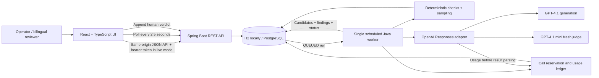
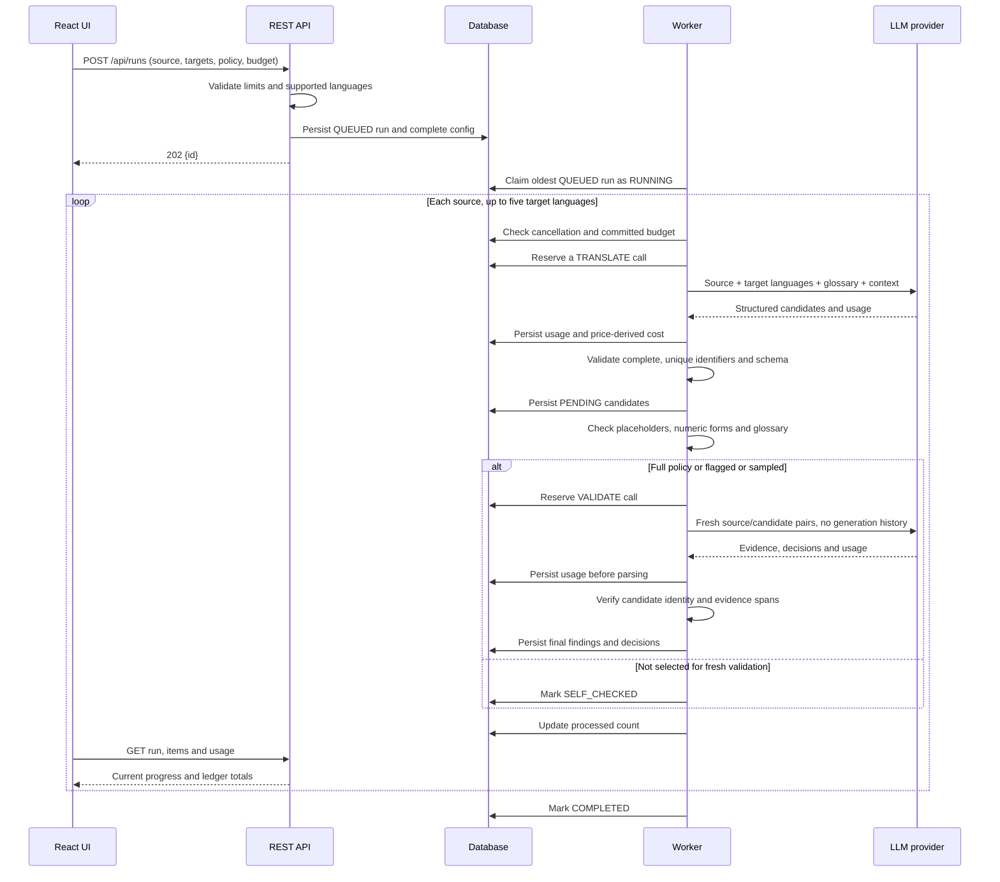
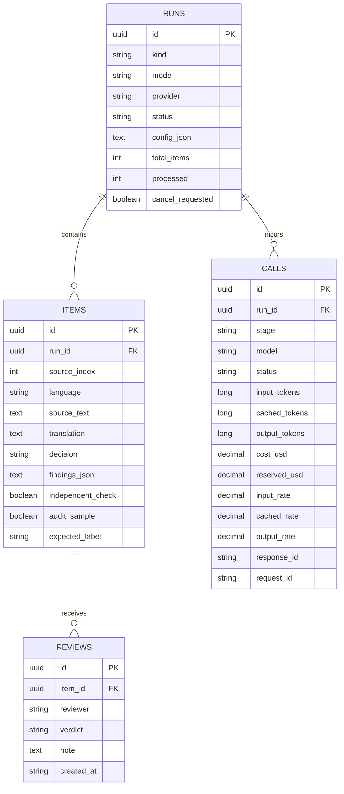

# Architecture and data flow

## Implemented deployment

Spring Boot serves the production React bundle and API from the same origin. The development Vite proxy keeps the same `/api` contract. The browser never receives the provider key. Live mode authenticates every `/api/*` request with a server-configured bearer token. This is a single-workspace access model, not user-level identity or tenancy.

## Translation sequence

The selected policy is immutable once the run is submitted. The accepted output is never automatically rewritten. An incorrect candidate stays inspectable as originally generated. Correcting translations and revalidating revisions would require an explicit versioned revision workflow; that is not implemented.

## Policy and decision precedence

1. A generator produces a compact self-check. Self-check findings and status can trigger routing, but are not passed to the fresh judge.
2. Application rules compare placeholder *multisets*, so dropped duplicate placeholders are detected. Visible numeric forms and missing verbatim glossary matches generate review signals. Locale-aware number normalization and morphological terminology validation are deliberately not claimed.
3. Full mode judges every candidate. Selective mode judges any non-accepted self-check, any self-reported finding, any rule finding, and a reproducible sample of otherwise accepted candidates. Sampling uses SHA-256 of run ID, source index and locale. The chosen rate is a Bernoulli probability, not an exact quota, and should be calibrated using real benchmarks.
4. The judge receives a fresh request without generator reasoning, confidence or self-findings. It evaluates source and candidate directly. This reduces contextual anchoring but does not remove shared model knowledge errors.
5. Missing/extra/duplicate IDs, mismatched locales, invalid decisions, changed candidate text, incomplete output or refusal cannot yield accepted items. Existing candidates remain pending when the batch fails.
6. Evidence spans must occur in source/target text. Unsupported evidence becomes an explicit human-review finding. This verifies span existence only, not the correctness of its explanation.
7. Application findings cannot be overridden by an LLM. Major/critical findings yield REJECT. Other findings yield REVIEW unless a major finding takes precedence. A clean fresh judgment can yield ACCEPT. Skipped fresh judgments yield SELF_CHECKED.

No reverse-translation step or additional automatic escalation model is implemented. These were optional diagnostics in the original discussion. The current escalation route is the human review workbench. Adding extra LLM checks should follow measured benefit on a benchmark and must use the same call ledger.

## Persistence model

There is one candidate per `(run, source_index, language)`. Two identical source sentences on different lines remain distinct because their source indices differ. Run configuration retains source text and policy so execution is inspectable. Calls record usage source, timestamps, latency, requested model, prices, provider IDs and a sanitized error. Provider response bodies and secrets are not logged.

Run states: `QUEUED → RUNNING → COMPLETED | CANCELLED | BUDGET_STOPPED | FAILED | INTERRUPTED`.

Call states: `PENDING → SIMULATED | REPORTED | INVALID | UNKNOWN`. `INVALID` means usable usage was recorded but the output could not be accepted. `UNKNOWN` means monetary usage is unresolved. A known zero is different from null/unknown.

## Failure and recovery boundaries

- Run creation persists before the worker executes. Queued work survives a restart.
- Each call reservation commits before network I/O. Provider usage commits before parsing model output.
- A cancellation flag is checked between calls, not during an HTTP request. An in-flight request can complete and incur cost after the user requests cancellation.
- The HTTP client has a connection timeout and a 90-second request timeout. HTTP 429, 5xx, timeout and invalid result errors stop the run; they are not automatically replayed.
- On startup, PENDING ledger entries become UNKNOWN and RUNNING jobs become INTERRUPTED. Completed item records remain intact. There is no automatic resume of an interrupted run because the previous request may have been billed.
- Job-creation requests do not implement idempotency keys. Do not blindly retry a timed-out creation request; first inspect the run list. The UI disables its submit button while submission is pending.
- There is no distributed lease protocol. Running multiple application replicas against one database would make restart recovery unsafe. The supplied deployment deliberately has one app service.
- One worker gives bounded request concurrency and simpler cost accounting. It does not enforce a configurable provider token-per-minute quota. Handle account-specific limits before sustained live production use.

## Evaluation and reporting

A benchmark submits pretranslated source/candidate pairs with known GOOD/BAD labels. It runs the same deterministic checks and fresh judge, without a generation call. Per-language aggregates preserve the denominator:

- False accepts: BAD candidates marked ACCEPT / completed BAD candidates.
- False rejects: GOOD candidates marked REJECT / completed GOOD candidates.
- Unnecessary flags: GOOD candidates marked REVIEW or REJECT / completed GOOD candidates.
- Pending candidates are excluded, not considered successful.

Human review aggregates use the latest verdict per item. Among accepted items with a definitive human verdict, the dashboard shows incorrect / assessed. This differs from the benchmark false-accept rate and is only a population-quality estimate when the reviewed subset is representative. Selective manual reviews are biased samples. Confidence intervals, stratified per-language audit scheduling, and reviewer adjudication are not included.

## Scaling path for 300,000 candidates

The API allows 10,000 sentences × 30 targets. With batches of five target languages, that can produce **60,000 generation calls** and roughly the same number of judge calls in full mode. Output lengths, context and API throughput determine runtime and cost. No empirical runtime or savings percentage is asserted.

For repeated enterprise-scale workloads, evolve the implemented boundaries:

1. Replace the single scheduled worker with durable tasks, leases, checkpoints and globally coordinated rate limits. Design replay and idempotency before enabling automatic retries.
2. Move full source datasets to managed object storage, add paginated run history (current UI lists the newest 100 runs), and use incremental materialized aggregates for large dashboards. Current summary queries scan a run's rows.
3. Add OIDC login, per-user/tenant authorization, verified reviewer identity, audit logging, encrypted managed storage, TLS, retention controls and backups. A shared bearer token is not an enterprise identity system.
4. Add approved per-language benchmarks, blinded human assessment, challenge-set versioning, calibration thresholds and confidence intervals. Model changes must trigger re-evaluation.
5. Reconcile usage against provider billing, account for discounts and product-specific fees, and add service-level provider budgets. Current per-run costs are text-token estimates based on reported usage.
6. Measure selective validation against full validation on the same held-out data; tune audit rates by language and severity. Unvalidated “self-checked” outputs must never silently become accepted.

These are deployment extensions, not features hidden behind nonfunctional buttons. The supplied app implements a complete local workflow, with explicit limits on its production guarantees.
